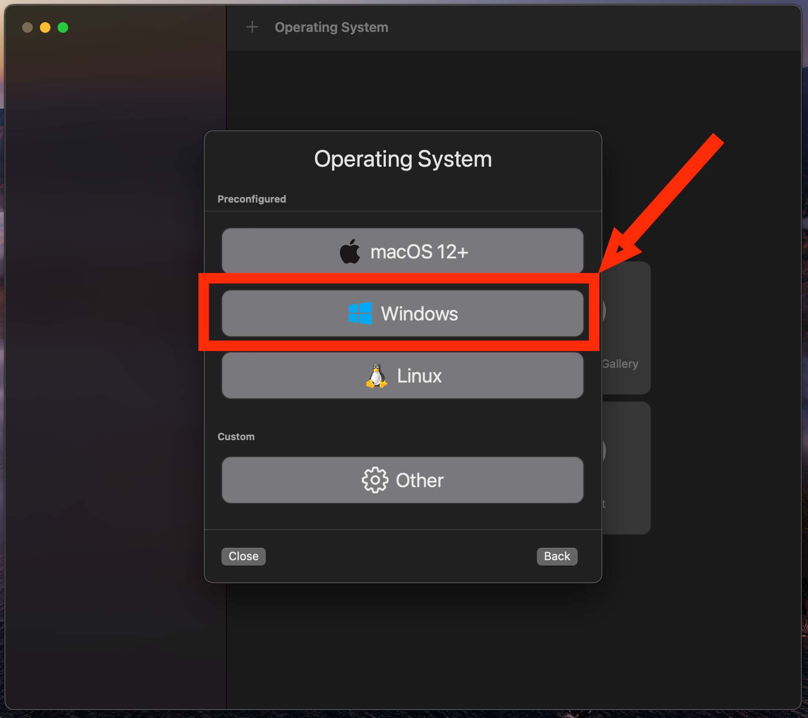

# Como executar o Windows11 no MacBook Air com M1 ou M2
 Como executar Windows11 no MacOS com processadores M1 da Apple

## O que é UTM?
O UTM é um emulador de sistema completo e host de máquina virtual para iOS e macOS. É baseado no QEMU. Resumindo, ele permite que você execute Windows, Linux e muito mais em seu Mac, iPhone e iPad. Confira os links à esquerda para mais informações.

## Necessário para Instalação:
- Macbook com chip M
- 8GB RAM
- 60 GB de espaço livre em disco
- UTM - Emulador ([**Baixar**](https://mac.getutm.app/))
- VM do Windows 11 para ARM ([**Baixar**](https://www.microsoft.com/en-us/software-download/windowsinsiderpreviewARM64))
- Comando para para Abrir o CMD

OBS: Se desejar, pode baixar um zip com todos os arquivos necessários para esse tutorial nesse link.

## Intalando o emulado UTM

1. Abra o arquivo UTM.dmg e arraste até a pasta Aplicativos para instalá-lo no Mac.

2. Através do Launchpad, abra o UTM no Mac e clique no botão + mais para criar uma nova máquina virtual.

3. Escolha “Virtualize” na tela “Start”.

4. Na tela "Operating System" selecione "Windows".

5. Clique no botão "Browse".

6. Selecione a imagem do Windows 11 VHDX ARM que você baixou e clique em "Open".

7. Com a imagem do Windows 11 selecionada, clique em "Next".

8. Escolha a quantidade de RAM e núcleos de CPU que você deseja designar para o Windows 11 (recomenda-se fornecer 4 GB de RAM ou mais para melhor desempenho, no caso da CPU pode deixar a opção "Default") e clique em "Next" novamente.

9. Na tela "Shared Directory" não precisa fazer nada, apenas clique em "Next".

10. Na tela "Summary", escolha “Save”.

11. Agora clique no grande botão Reproduzir para inicializar a VM do Windows 11 e iniciar a configuração.

12. Antes de prosseguir, vamos habilitar a opção "Eu não tenho internet" com o comando Fn + Shift + F10

13.