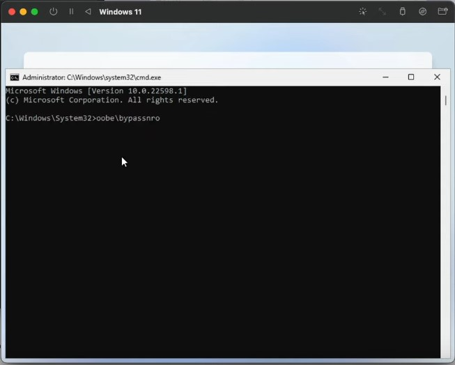
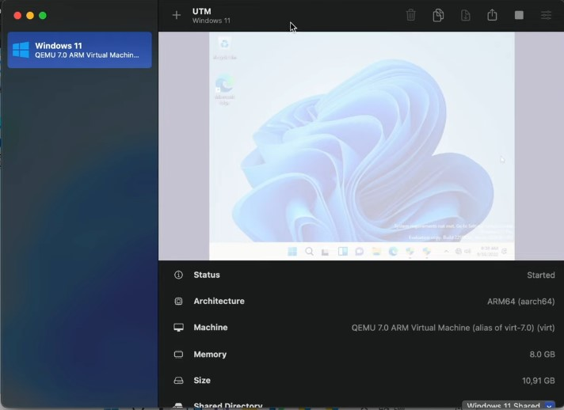

# Como executar o Windows11 no MacBook Air com M1 ou M2
 Como executar Windows11 no MacOS com processadores M1 da Apple

 Esse passo a passo é voltado especificamente para Apple Silicon Macs. Os Macs Intel oferecem muitas outras maneiras de executar o Windows 11 em máquinas virtuais, como VirtualBox, VMware, Parallels, etc.

## O que é UTM?
O UTM é um emulador de sistema completo e host de máquina virtual para iOS e macOS. É baseado no QEMU. Resumindo, ele permite que você execute Windows, Linux e muito mais em seu Mac, iPhone e iPad. Confira os links à esquerda para mais informações.

## Necessário para Instalação:
- Macbook com chip M1 ou superior
- 8GB RAM
- 60 GB de espaço livre em disco
- UTM - Emulador ([**Baixar**](https://mac.getutm.app/))
- SPICE Guest Tools ([**Baixar**](https://github.com/utmapp/qemu/releases/download/v6.2.0-utm/spice-guest-tools-0.164.3.iso))
- VM do Windows 11 para ARM ([**Baixar**](https://www.microsoft.com/en-us/software-download/windowsinsiderpreviewARM64)) ou Baixar pelo UUP dump ([**Baixar**](https://uupdump.net/known.php))
- Comando para para Abrir o CMD

OBS: Se desejar, pode baixar um zip com todos os arquivos necessários para esse tutorial nesse link.

## Intalando o emulado UTM e Maquina VM do Windows 11 ARM

1. Abra o arquivo UTM.dmg e arraste até a pasta Aplicativos para instalá-lo no Mac.


2. Através do Launchpad, abra o UTM no Mac e clique no botão + mais para criar uma nova máquina virtual.


3. Escolha “Virtualize” na tela “Start”.


4. Na tela "Operating System" selecione "Windows".


5. Clique no botão "Browse".


6. Selecione a imagem do Windows 11 VHDX ARM que você baixou e clique em "Open".


7. Com a imagem do Windows 11 selecionada, clique em "Next".


8. Escolha a quantidade de RAM e núcleos de CPU que você deseja designar para o Windows 11 (recomenda-se fornecer 4 GB de RAM ou mais para melhor desempenho, no caso da CPU pode deixar a opção "Default") e clique em "Next" novamente.


9. Na tela "Shared Directory" não precisa fazer nada, apenas clique em "Next".


10. Na tela "Summary", escolha “Save”.


11. Agora clique no grande botão Reproduzir para inicializar a VM do Windows 11 e iniciar a configuração.


12. Antes de prosseguir, vamos habilitar a opção "Eu não tenho internet" com o atalho:
```bash
Fn + Shift + F10
```


13. Escolha YES, para abrir o CMD.


14. Execute o comando: oobe\bypassnro e precione ENTER, a maquina virtual será reiniciada.
```bash
oobe\bypassnro
```



15. Após maquina inciar siga com o processo de configuração do Windows 11 como de costume, escolhendo sua região, nome da conta, etc.. em seguida o Windows 11 vai fazer sua auto configuração. Aguarde alguns minutos e o Windows 11 será iniciado na Máquina Virtual no Mac chip M.


## Instalando SPICE Guest Tools (Otimizar Maquina Virtual)

1. Retorne na janela de Controle do UTM



2. Na opção CD/DVD > Browser, selecione a imagem ISO do SPICE Guest Tools.


3. Selecione o arquivo spice-guest-tools-X.XXX.X.iso e clique em "open".


4. Retorne a Maquina Virtual Windwos 11 e selecione a unidade de CD no canto esquerdo da tela, em seguida clique duas vezes no arquivo spice-guest-tools-X.XXX.X. Vai abrir um instalador. É só você seguir os passos e intalar o programa.


5. Na ultma tela do instalador será necessário Reinicar o Windows, clique em Finish para reiniciar.


 Com isso a maquina virtual com Windows 11 já esta instalado.
